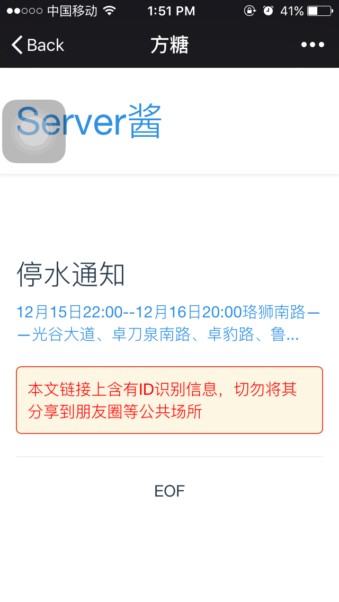
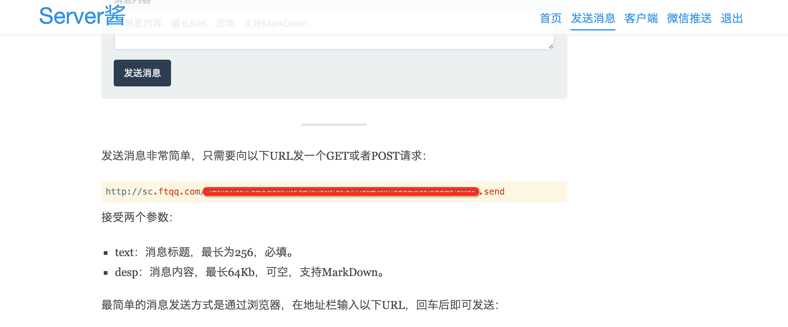

# WaterSupplyMonitor
通知啥时停水。因为我们学校经常停水，导致大家十分烦恼：不知道啥时停水，不知道为啥停水，不知道啥时来水，所以做个通知服务。

### 数据来源
[武汉市水务集团有限公司－停水通知](http://www.whwater.com/gsfw/tstz/)

### 自用
- `pip install -r requirements.txt`
- `celery -A WaterSupplyMonitor worker -B -l info`

### 服务
- `pip install -r requirements.txt`
- `celery -A WaterSupplyMonitor worker -B -l info`
- `python AddInformURL.py`

### 关键词过滤
 添加你所关注的地区的关键词获取停水通知

### 通知服务
这个应用所使用的通知服务：[Server酱](http://sc.ftqq.com/2.version)（并无利益相关，只是好用）。欢迎大家注册，获取通知地址，然后可以通过[点击这里](http://add.stamaimer.com)添加你的通知地址，就可以获得武汉大学附近的停水通知。

